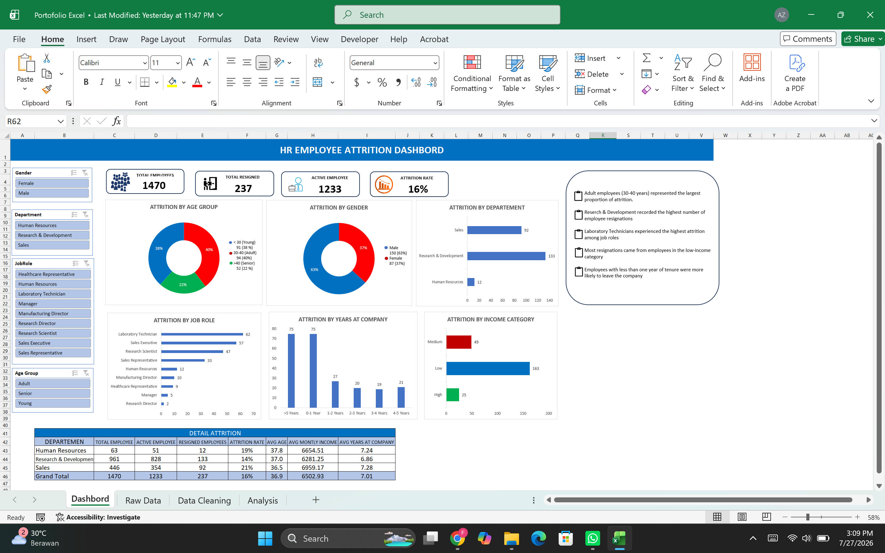

# HR Employee Attrition Dashboard

## Overview
This project presents an interactive HR dashboard developed in Microsoft Excel using a public Kaggle dataset.

## Objectives
- Analyze employee attrition trends.
- Visualize HR metrics using interactive dashboards.
- Support HR reporting with KPI dashboards.

## Tools Used
- Microsoft Excel
- Pivot Table
- Pivot Chart
- Slicers

## Dataset
Public Kaggle HR Employee Attrition Dataset
# HR Employee Attrition Dashboard

## Dashboard Preview

## Overview
Interactive HR dashboard using a public Kaggle dataset.
